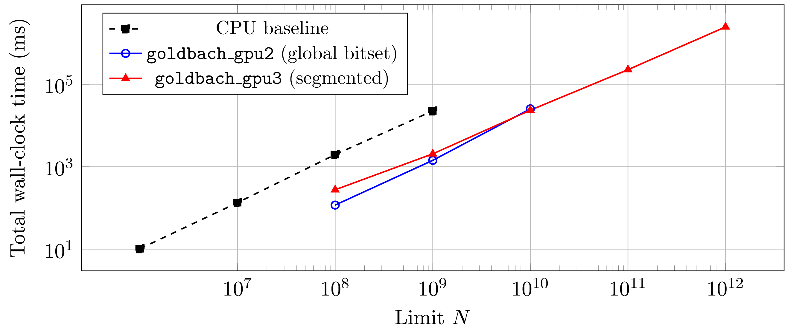

[](https://doi.org/10.5281/zenodo.18786328)


# goldbach-gpu

GPU-accelerated verification of Goldbach's conjecture using CUDA and GMP.

**Goldbach's conjecture** states that every even integer greater than 2 can be
expressed as the sum of two prime numbers. First proposed in 1742, it remains
one of the oldest unsolved problems in mathematics. Verified computationally up
to 4×10¹⁸ by distributed computing [[1]](#references), but never formally proved.

This project provides an open source, reproducible framework for exhaustive
range verification and arbitrary precision single-number checking on consumer
hardware. **No counterexamples have been found in any computation.**

---

## Headline result
The following figure shows total wall‑clock time to verify all even integers up to \(N\) using the three main implementations:

- **CPU baseline** (`cpu_goldbach`)
- **GPU** (`goldbach`)



> **Single GPU** All even integers up to 10¹² verified on a single NVIDIA RTX 5090 in 37 seconds.
> 
> **Cloud / HPC:** Verification up to 10¹² in 18.8 seconds with 2x NVIDIA RTX 5090.

This is achieved by our multi-GPU, segmented double-sieve verifier with dynamic load balancing, GPU-tiled sieving, and optimized Phase 2 fallbacks. See [Architecture](#architecture) and [Results](#results-summary) below.

---

## Project goals

- Verify Goldbach's conjecture to the largest range feasible on consumer hardware
- Demonstrate GPU-accelerated number theory with rigorous correctness guarantees
- Benchmark and compare CPU vs GPU architectures for sieve-based computation
- Provide fully reproducible scientific results on a fixed hardware platform
- Serve as a reference implementation for GPU Goldbach verification

---

## Architecture

The project contains multiple tools of increasing capability, each validating
against the previous:

| Tool | Method | Range | Hard limit |
|------|--------|-------|------------|
| `goldbach` | multi-GPU, segmented double-sieve | exhaustive | time only |
| `cpu_goldbach` | CPU sieve + sequential scan | exhaustive | system RAM / time |
| `single_check` | GPU Miller-Rabin | single number | uint64_t (~1.8×10¹⁹) |
| `big_check` | GMP + OpenMP | single number | time only |

### Design evolution

**goldbach_gpu** stores primality as one byte per number. At 10⁹ this requires
953 MB VRAM -- already approaching limits. Not usable beyond 10⁹ on 8 GB GPUs.

**goldbach_gpu2** encodes one bit per odd number, a 16× memory reduction.
This makes 10¹¹ feasible (5,960 MB) but 10¹² impossible (would need 59 GB).
The VRAM ceiling is architectural -- no amount of runtime can overcome it.

**goldbach_gpu3** removes the ceiling entirely via a segmented design. For each
segment [A, B] of even numbers, it iterates over candidate primes p and marks
all n in [A, B] where n-p is prime as verified. Crucially, q = n-p is checked
globally (small bitset, segment bitset, or Miller-Rabin) -- not forced into
the current segment, which would miss valid partitions. Each segment uses only
~60 MB VRAM regardless of total range. An exhaustive CPU fallback guarantees
rigor for any number the GPU phase does not resolve; in all runs to date,
this fallback has never been triggered.

**goldbach**  (flagship) extends goldbach_gpu3 with multi-GPU support via lock-free work queues and thread-safe globals. It adds GPU-tiled sieving for segments, optimized Phase 2 (sieve to 10^8 + Miller-Rabin), overflow-safe operations (P_SMALL ≤ 4e9), and configurable CLI options (e.g., --seg-size, --gpus). Correctness is mathematically rigorous for n up to 2^64-1.

**big_check** handles numbers of arbitrary digit count using GMP exact
arithmetic and probabilistic Miller-Rabin (25 rounds, false positive
probability < 10⁻¹⁵). OpenMP parallelism with batch-synchronised prime
search prevents thread runaway for large inputs.

---

## Results summary

Full benchmark log: [RESULTS.md](RESULTS.md)

### Range verification -- exhaustive, all even n in [4, N]

| Tool | Limit | Even n checked | Total time | Failures |
|------|-------|----------------|------------|----------|
| `cpu_goldbach` (CPU) | 10⁹ | 499,999,999 | 22,568 ms | 0 |
| `cpu_goldbach` (CPU) | 10¹⁰ | 4,999,999,999 | 308,335 ms | 0 |
| `goldbach_gpu2` | 10⁹ | 499,999,999 | 1,344 ms | 0 |
| `goldbach_gpu2` | 10¹⁰ | 4,999,999,999 | 25,034 ms | 0 |
| `goldbach_gpu3` | 10¹² | 499,999,999,999 | 5,760,350 ms | 0 |

GPU speedup over CPU baseline: **16× total at 10⁹**.
goldbach_gpu3 reaches 10¹² which no single-GPU implementation can reach
with a global bitset design on 8 GB VRAM.

### Single number verification

| Tool | n | Partition | Time |
|------|---|-----------|------|
| `single_check` | 10¹⁸ | 14,831 + 999,999,999,999,985,169 | 1.5 s |
| `single_check` | 10¹⁹ | 226,283 + 9,999,999,999,999,773,717 | 1.5 s |
| `big_check` | 10¹⁰⁰⁰ | p = 26,981 | 363 ms (20 threads) |
| `big_check` | 10¹⁰⁰⁰⁰ | p = 47,717 | 182 s (20 threads) |

---

## Build

```bash
mkdir build && cd build
cmake .. -DCMAKE_BUILD_TYPE=Release -DBUILD_LEGACY=OFF
cmake --build . -j$(nproc)
```

**Dependencies:** CUDA toolkit, GMP, OpenMP.

```bash
sudo apt install libgmp-dev    # GMP
# CUDA toolkit: https://developer.nvidia.com/cuda-downloads
```

---

## Usage

All tools now support modular CLI argument parsing and feature dynamic hardware safety guards to prevent Out-Of-Memory (OOM) crashes. Pass `-h` or `--help` to any tool for detailed usage instructions.

All compiled executables are located in the `build/bin/` directory.

### CPU range verifier
```bash
./build/bin/cpu_goldbach 1000000000
```
Useful as a correctness baseline. 
Expected time: ~23 s at 10⁹, ~5 min at 10¹⁰.

### Flagship multi-GPU segmented verifier (recommended)
```bash
./build/bin/goldbach 1000000000000 --seg-size=200000000 --p-small=1000000 --batch-size=2000000
```
No VRAM ceiling. Hardware VRAM is checked against the segment size at launch to ensure safe execution. Expected time: 36.5 s at 10¹² (1x RTX 5090).

To reproduce the 10¹² result with specific segmentation and prime bounds:
```bash
./build/bin/goldbach 1000000000000 --seg-size=200000000 --p-small=1000000 --batch-size=2000000
```

For Multi-GPU / Cloud environments (use all available GPUs with --gpus=-1):
```bash
./build/bin/goldbach 1000000000000 --seg-size=200000000 --p-small=1000000 --batch-size=2000000 --gpus=2
```

### GPU single number checker (up to ~1.8×10¹⁹)
```bash
./build/bin/single_check 999999999999999998
```
Uses deterministic Miller-Rabin with 12 witnesses. Returns a valid partition but not necessarily the minimal one (due to concurrent GPU thread execution).

### Arbitrary precision checker (any size)
```bash
./build/bin/big_check 12321232123212321232123212321232
./build/bin/big_check "$(python3 -c "print('1' + '0'*1000)")"    # 10^1000
./build/bin/big_check "$(python3 -c "print('1' + '0'*10000)")"   # 10^10000
```

Candidate primes p are generated deterministically by a standard Sieve of Eratosthenes up to 10^7 (664,579 primes). For each p, q = n - p is computed exactly using GMP arbitrary precision arithmetic, then tested for primality using GMP's Miller-Rabin with 25 rounds (false positive probability < 4^-25 ≈ 10^-15 per test). Since p is sieve-generated, only the test on q is probabilistic.

Primes are processed in batches of 1,000 with a synchronisation barrier between batches. This prevents thread runaway: without batching, fast threads on small-p tests could race far ahead of slow threads doing expensive GMP tests, causing a large non-minimal p to be returned first. With batching, the winning p is the smallest in the first batch containing a valid partition.

Practical limit: GMP primality tests scale roughly as O(d^3) in digit count d. At 10^10000 (d = 10,001) each test takes milliseconds; beyond ~10^50000 each test takes seconds and exhaustive search becomes infeasible in practice.

### Validation tests
The framework includes a comprehensive automated validation suite that tests core functionality, CLI robustness, and negative hardware guards (e.g., safe failure on massive VRAM requests).
```bash
cd tests
./validation.sh
```

---

## Reproducibility
To record your environment:
```bash
nvcc --version
gcc --version
apt show libgmp-dev 2>/dev/null | grep Version
```

All benchmark configurations (LIMIT, SEG_SIZE, P_SMALL, thread counts)
are documented in [RESULTS.md](RESULTS.md) for each run.

Single number results were produced on the following fixed platform:

| Component | Specification |
|----------|---------------|
| **CPU** | Intel i7‑12700H, 20 logical threads |
| **GPU** | NVIDIA RTX 3070 mobile, 8 GB VRAM, 448 GB/s bandwidth |
| **RAM** | 32 GB |
| **OS** | WSL2, Ubuntu 24.04 |
| **CUDA Toolkit** | 13.1.115 |
| **CUDA Build Info** | cuda_13.1.r13.1/compiler.37061995_0 (Dec 16 2025) |
| **GCC** | 13.3.0 (Ubuntu 13.3.0-6ubuntu2~24.04.1) |
| **OpenMP** | 4.5 |
| **GMP** | 6.3.0+dfsg-2ubuntu6.1 |

All range verification results were produced on the following platform:

| Component | Specification |
|----------|---------------|
| **GPU** | NVIDIA GeForce RTX 5090, 32 GB VRAM, Driver 580.95.05, CUDA 13.0 |
| **CPU** | Dual‑socket AMD EPYC (Engineering Sample 100‑000000897‑03), 128 logical cores; Effective: 13.6 vCPUs (cgroup quota: 1360000 / 100000) |
| **Memory** | 44GB |
| **Environment** | Ubuntu (containerized); GPU access: Full, non‑virtualized RTX 5090 |
| **OS** | Ubuntu 24.04 |
| **CUDA Toolkit** | 13.0 |
| **GCC** | 13.3.0 (Ubuntu 13.3.0-6ubuntu2~24.04.1) |
| **OpenMP** | 4.5 |
| **GMP** | 6.3.0+dfsg-2ubuntu6.1 |

All timings are wall‑clock time. All configurations are recorded exactly as run so results are fully reproducible.

---

## 📂 Project Structure

```text
- `src/`
  - `goldbach.cu`        : Multi-GPU range verifier (Flagship).
  - `goldbach_gpu5a.cu`  : (experimental for testing new features).
  - `big_check.cpp`      : Arbitrary precision checker (GMP + OpenMP).
  - `single_check.cu`    : 64-bit deterministic Miller-Rabin checker.
  - `cpu_goldbach.cpp`   : Sequential CPU baseline oracle.
  - `prime_bitset.cpp`   : Parallel bitset construction.
  - `segmented_sieve.cpp`: CPU-based sieving logic.
- `include/`
  - `prime_bitset.hpp`   : Core data structures and bit-indexing logic.
- `legacy/`
  - `goldbach_gpu3.cu`   : Historical GPU implementation.
- `tests/`
  - `validation.sh`      : Automated correctness and robustness test suite.
```

---

## How to cite

If you use this work, please cite:

```
Llorente-Saguer, I. (2026). GoldbachGPU (v1.1.0) [Software]. Zenodo.
https://doi.org/10.5281/zenodo.18837081
```
For the latest version, see the concept DOI:
https://doi.org/10.5281/zenodo.18786328
A preprint will be submitted to arXiv shortly.

---

## References

[1] T. Oliveira e Silva, S. Herzog, S. Pardi, "Empirical verification of the
even Goldbach conjecture and computation of prime gaps up to 4×10¹⁸",
*Mathematics of Computation*, 83(288):2033–2060, 2014.

---

## License

MIT
